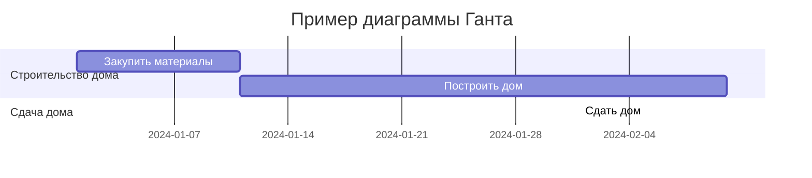
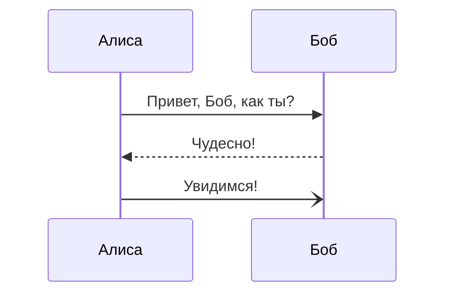
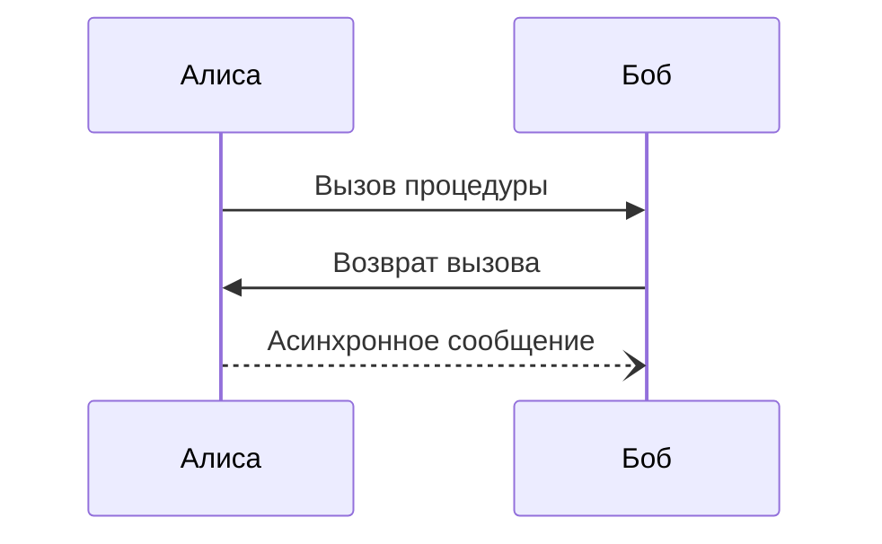

#### 1. Система. Понятие сложной системы и его историческое развитие.

**Система** — это множество элементов, находящихся во взаимодействиях, отношениях, связях и благодаря этому представляющих целостность.

#### 2. Подсистемы, компоненты и элементы, связи между ними.

**Элемент системы** — предел членения системы с точки зрения аспектов рассмотрения, решения конкретной задачи, поставленной цели *(простейшая, неделимая часть системы).*

**Структура системы:**
* Система
* Подсистема
* Элемент
* Элемент
* Подсистема
* Элемент
* Элемент
* Элемент
* Элемент

**Связь** — взаимное ограничение объектов, создающее ограничение на их поведение, зависимость между ними, обмен между элементами веществом, энергией, информацией (объединяет элементы системы в одно целое).

**Классификация связей:**
— По направлению:
* Направленные и ненаправленные;
* Одностронние и двусторонние;
* Прямые и обратные.

— По силе:
* Сильные и слабые.

— По характеру:
* Положительные и отрицательные.

— По смыслу:
* подчинения;
* порождения;
* равноправия;
* безразличия;
* управления.

#### 3. Структура, функции, переменные, параметры состояния и характеристики большой системы.

**Структура** — совокупность элементов системы и связей между ними.

**Состояние системы** — совокупность существенных свойств, которыми система обладает в каждый момент времени.

#### 4. Понятие целостности.

Под **целостностью** системы понимается внутреннее единство и принципиальная не сводимость свойств системы к сумме свойств составляющих ее элементов.

В простейшем случае считается, что наличие связей и отношений между элементами системы как раз и выражает ее целостность, так что никаких специальных средств, кроме задания этих отношений, не требуется. При этом признак целостности не вводится в определение системы. Это характерно для определений, сложившихся вне системного подхода. Понятно, что не всякие отношения придают множеству элементов целостность. Поэтому выделяются специальные отношения, которые называются  _системообразующими._

#### 5. Виды организационных диаграмм.

Основные организационные диаграммы:

* Диаграмма вариантов использования;
* Диаграмма классов анализа;
* Диаграмма последовательности;
* Диаграмма классов;
* Диаграмма деятельности;
* Диаграммы компонентов, развертывания.

#### 6. Понятие сложной системы. Понятие дискретности.

**Сложная система** — система, состоящая из множества взаимодействующих составляющих (подсистем), вследствие чего сложная система приобретает новые свойства, которые отсутствуют на подсистемном уровне и не могут быть сведены к свойствам подсистемного уровня.

**Дискретность** — свойство, противопоставляемое непрерывности, прерывистость. Так, дискретным называют процесс, изменяющийся между несколькими различными стабильными состояниями.

#### 7. Построение организационных диаграмм. Нотация ARIS.

**ARIS**  *(Architecture of Integrated Information Systems)*  —  методология  и тиражируемый программный продукт для  моделирования  бизнес-процессов организаций.

Любая организация в методологии ARIS рассматривается с пяти точек зрения: организационной, функциональной, обрабатываемых данных, структуры бизнес-процессов, продуктов и услуг. При этом каждая из этих точек зрения разделяется ещё на три подуровня: описание требований, описание спецификации, описание внедрения.

Для описания бизнес-процессов предлагается использовать около 80 типов моделей, каждая из которых принадлежит тому или иному аспекту. ARIS предоставляет визуальный инструментарий для обеспечения наглядности моделей. Также инструментарий поставляется с набором референтных моделей, заранее разработанных для типичных процессов в различных отраслях. Общий принцип в инструментарии — возможность интеграции моделей разных типов в рамках одного репозитория посредством декомпозиции (детализации) объектов. Таким образом, любую организацию можно описать с помощью иерархии моделей — от обобщения: например, процессы верхнего уровня с помощью модели VACD (англ. value added chain diagram) до уровня процедур и ресурсного окружения функций.

Среди большого количества возможных методов описания можно выделить следующие:

* **eEPC** *(extended event-driven process chain)* — метод описания процессов;
* **ERM** *(entity-relationship model)* — модель «сущность-связь» для описания структуры данных;
* **UML** *(unified modeling language)* — унифицированный объектно-ориентированный язык моделирования.

#### 8. Свойства системы. Понятие гармонии.

**Гармония** —  это соразмерность, слаженность, согласованность частей целого.

#### 9. Классификация систем. Понятие иерархии.

Главным признаком классификации является *субстанциональный признак*, по которому выделяют четыре класса систем:

* Искусственные;
* Естественные
* Идеальные и концептуальные системы;
* Виртуальные.

**Системы классифицируются следующим образом:**

1. По виду отображаемого объекта:

- _технические;_
- _биоло­гические;_
- _социологические;_
- _экономические и др._

2. По связям с окружением (тип целеустремленности):

- _открытые (с определенным окружением, то есть хотя бы с одним входом и одним выходом);_
- _закрытые (без связей с окружением)._

3. По изменению состояния:
- _динамические (состояние изменяется с течением времени);_
- _статические (состояние не изменяется с течением времени)._

4. По характеру функционирования:

- _детерминированные (в зависимости от состояния системы можно однозначно судить о ее функционировании);_
- _стохастические (можно только высказать предположения относительно различных возможных вариантов функционирования)._

5. По виду элементов (относительно их конкретности):

- _конкретные (элементами являются реальные объекты);_
- _абстрактные (элементы – абстрагированные объекты)._

**Иерархия**  — это положение частей или элементов системы в порядке от высшего к низшему, подчинение.

#### 10. Диаграмма Ганта, календарное планирование.

**Диаграмма Ганта** (англ. Gantt chart, также ленточная диаграмма, график Ганта, календарный график) — это популярный тип столбчатых диаграмм (гистограмм), который используется для иллюстрации плана, графика работ по какому-либо проекту. Является одним из методов планирования проектов. Используется в приложениях по управлению проектами.

#### 11. Характеристика задач системного анализа.

Можно выделить следующие задачи системного анализа:

* **_поиск_** альтернативных вариантов решения проблемы;
* **_выявление и анализ_** масштабов неопределенности по каждому из вариантов;
* **_анализ возможных вариантов_** по тем или иным вариантам эффективности.

#### 12. Понятие адекватности.

**Адекватность модели**  — это совпадение свойств (функций, параметров, характеристик и т. п.) модели и соответствующих свойств моделируемого объекта.

#### 13. Основные диаграммы UML.

Существует два основных типа диаграмм UML: *структурные* и *поведенческие.*

**Структурные диаграммы:**

1. Диаграмма классов.
2. Диаграмма компонентов.
3. Диаграмма композитной структуры.
4. Диаграмма развёртывания.
5. Диаграмма объектов.
6. Диаграмма пакетов.

**Диаграммы поведения:**

1. Диаграмма деятельности.
2. Диаграмма автомата или диаграмма состояний.
3. Диаграмма прецедентов или диаграмма вариантов использования.
4. Диаграмма коммуникации.
5. Диаграмма последовательности.
6. Диаграмма обзора взаимодействия.
7. Диаграмма синхронизации.

#### 14. Особенности задач системного анализа.

1. Декомпозиция:  представление  системы  в  виде  подсистем  и  их  элементов.
2. Анализ:  поиск  атрибутов  системы  и  окружающей  среды.
3. Синтез  системы:  создание  системы  на  основе  определённого  алгоритма.

#### 15. Закон функционального развития (эволюции).

**Закон функционального развития (эволюции)** или *закон целостности* — способность системы претерпевать изменения внутри своей оболочки или окружающей среды, сохраняя самое себя.

Первый закон теории систем раскрывает сущность системы как единого, целого образования и может отвечать на вопрос «что» такое система. В рамках этого закона описываются ряд закономерностей структурной организации свойств, связей и отношений между элементами, ограниченных единой формой существования. Жизнедеятельность такой системы обеспечена внутренней организацией системы управления общими ресурсами. Устойчивое или неустойчивое состояние системы зависит от скорости обмена между элементами системы потоками энергии, информации и вещества. В процессе такого обмена часто элемент может потерять свои свойства или приобрести новые, с условием всех изменений в рамках единой формы существования.

#### 16. Дополнительные диаграммы UML.

* Диаграмма пакетов;
* Диаграмма объектов;
* Диаграмма обзора взаимодействия;
* Временная диаграмма;
* Диаграмма композитной структуры;
* Диаграмма коммуникации.

#### 17. Система и среда. Виды и формы представления структур систем: линейная, сетевая, иерархическая, многоуровневая, матричная, смешанные и др.

Система и среда — это взаимосвязанные понятия в теории систем. Система представляет собой совокупность взаимодействующих элементов, образующих определённую целостность, а среда — это окружение, в котором существует система.

Виды и формы представления структур систем включают:

1. Линейная структура — последовательное соединение элементов без разветвлений.
2. Сетевая структура — система, состоящая из множества элементов, связанных между собой.
3. Иерархическая структура — система, имеющая несколько уровней, где каждый уровень подчинён вышестоящему уровню.
4. Многоуровневая структура — система, состоящая из нескольких иерархических уровней.
5. Матричная структура — система, в которой элементы связаны между собой через матрицу отношений.
6. Смешанные структуры — системы, сочетающие различные виды структур, например, иерархические и матричные.

#### 18. Закон функциональной иерархии (целеобразования) систем.

**Закон функциональной иерархии систем** — это закон, который сформулирован на основе принципа иерархии элементов в системе.

Он объясняет целеобразование (образование цели) функционирования данной системы в окружающей среде, её функциональное назначение.

Этот закон отвечает на вопрос «как» нужно управлять системой для её полезного использования, не доводя до разрушения.

#### 19. Общая схема взаимосвязей моделей и представлений сложной системы в процессе объектно-ориентированного анализа.

Общая схема взаимосвязей моделей и представлений сложной системы в процессе объектно-ориентированного анализа включает иерархическое построение моделей на разных уровнях абстрагирования или детализации. Исходная модель сложной системы имеет наиболее общее представление (метапредставление). Затем происходит последовательное дополнение моделей всё большим количеством деталей на логических и физических уровнях.

#### 20. Методы исследования систем.

Методы исследования систем включают:

1. Теоретические методы: метод линейного программирования, метод точечной интерполяции, метод Монте-Карло, графические методы.
2. Логико-интуитивные методы: экспертные методы исследования, тестирование, метод «дерева целей», SWOT-анализ, матричный метод.
3. Эмпирические методы: наблюдение, изучение документации, сравнение, измерение, эксперимент.
4. Комплексно-комбинированные методы: системный анализ и синтез, факторный и корреляционный анализ, функционально-стоимостной анализ, параметрический метод, квалиметрические методы, аудит.

#### 21. Понятие среды.

В контексте анализа систем среда — это совокупность объектов, которые влияют на систему и на которые система влияет в процессе своего функционирования. Среда всегда рассматривается относительно конкретной системы и включает все элементы, не входящие в эту систему, но с которыми она может взаимодействовать.

#### 22. Диаграммы классов. Классы, атрибуты, операции.

**Классом** называется именованное описание совокупности объектов с общими атрибутами, операциями, связями и семантикой. Графически класс изображается в виде прямоугольника.

**Атрибутом класса** называется именованное свойство класса, описывающее множество значений, которые могут принимать экземпляры этого свойства. Класс может иметь любое число атрибутов.

**Операцией класса** называется именованная услуга, которую можно запросить у любого объекта этого класса. Операция — это абстракция того, что можно делать с объектом. Класс может содержать любое число операций.

#### 23. Процедуры системного анализа.

Основные процедуры системного анализа:

- изучение структуры системы, анализ её компонентов, выявление взаимосвязей между отдельными элементами;
- сбор данных о функционировании системы, исследование информационных потоков, наблюдения и эксперименты над анализируемой системой;
- построение моделей;
- проверка адекватности моделей, анализ неопределённости и чувствительности;
- исследование ресурсных возможностей;
- определение целей системного анализа;
- формирование критериев;
- генерирование альтернатив;
- реализация выбора и принятие решений;
- внедрение результатов анализа;

#### 24. Понятие элемента. Диаграммы классов.

**Элементом** системы является часть системы с однозначно определёнными свойствами, выполняющие определённые функции и не подлежащие дальнейшему разбиению в рамках решаемой задачи (с точки зрения исследователя).

#### 25. Отношения ассоциации и обобщения между классами.

**Ассоциация** — отношение между классами, при котором один класс ссылается на один или несколько экземпляров другого класса по одному или нескольким идентификационным параметрам. Допускается, чтобы оба конца ассоциации относились к одному классу. В ассоциации могут связываться два класса, и тогда она называется бинарной.

**Обобщение (наследование)** - это отношение типа общее-частное между элементами модели. С помощью обобщений *(generalization)* показывают связи наследования между двумя классами. Большинство объектно-ориентированных языков непосредственно поддерживают концепцию наследования. Она позволяет одному классу наследовать все атрибуты, операции и связи другого.

#### 26. Анализ структуры системы.

Анализ структуры системы — это процесс исследования системы управления, основанный на её декомпозиции и определении статических и динамических характеристик составляющих элементов во взаимосвязи с другими элементами системы и окружающей средой. Этот процесс включает задачи структурирования системы, определения функциональных особенностей, исследования информационных характеристик, определения количественных и качественных показателей, оценки эффективности и обобщения результатов анализа.

#### 27. Понятие подсистемы.

**Подсистема** — это промежуточный комплекс, который является более сложным, чем элементы системы, но менее сложным, чем сама система.

#### 28. Основные составляющие структуры системы.

1. **Элемент** — предел членения системы с точки зрения аспекта рассмотрения, решения конкретной задачи, поставленной цели.
2. **Компонент, подсистема** — относительно независимая часть системы, обладающая свойствами системы и имеющая подцель.
3. **Связь, отношение** — ограничение степени свободы элементов: элементы, вступая во взаимодействие (связь) друг с другом, утрачивают часть свойств или степеней свободы, которыми они потенциально обладали.
4. **Структура** — наиболее существенные компоненты и связи, которые мало меняются при функционировании системы и обеспечивают существование системы и её основных свойств.

Структура характеризует организованность системы, устойчивую во времени упорядоченность элементов и связей.

#### 29. Системный анализ в моделировании.

Системный анализ в моделировании — это методология, которая помогает анализировать сложные системы и процессы, учитывая их взаимосвязь и влияние друг на друга. Он состоит из следующих этапов:

1. Определение целей и задач системы.
2. Выявление всех элементов и подсистем, которые составляют систему.
3. Установление связей между элементами и подсистемами.
4. Анализ влияния каждой подсистемы на общую систему и наоборот.
5. Оценка эффективности системы и поиск возможных улучшений.
6. Разработка моделей и алгоритмов для управления и оптимизации системы.

Системный анализ используется в различных областях, таких как управление проектами, бизнес-анализ, информационные технологии и научные исследования.

#### 30. Диаграммы последовательности. Объекты и их изображение на диаграмме последовательности.

**Диаграмма последовательности** — это UML-диаграмма, на которой для некоторого набора объектов на единой временной оси показан жизненный цикл объекта (создание, деятельность, уничтожение) и взаимодействие акторов (действующих лиц) информационной системы в рамках прецедента.

**Основные элементы диаграммы последовательности:**

1. Обозначения объектов (прямоугольники с названиями объектов).
2. Вертикальные «линии жизни», отображающие течение времени.
3. Прямоугольники, отражающие деятельность объекта или исполнение им определенной функции.
4. Стрелки, показывающие обмен сигналами или сообщениями между объектами.

#### 31. Формы представления структур.

В анализе систем используются различные формы представления структур, такие как:

1. **Сетевые структуры** — показывают порядок действий или этапов процесса, например, сетевой график производства или проектирования.
2. **Иерархические структуры** — отражают декомпозицию системы в пространстве, где каждый уровень имеет свои компоненты и связи. Могут быть древовидными (с “сильными” связями) или иметь “слабые” связи между элементами разных уровней.
3. **Матричные структуры** — соответствуют иерархическим структурам, но отношения между элементами представлены в виде матрицы.
4. **Многоуровневые иерархические структуры** — включают стратифицированные, слоистые, эшелонированные и смешанные структуры, которые позволяют анализировать систему на разных уровнях абстракции.
5. **Смешанные иерархические структуры** — объединяют вертикальные и горизонтальные связи для более точного отображения взаимодействия элементов системы

Эти формы помогают лучше понять структуру системы, выявить её ключевые элементы и связи между ними, что важно для анализа и оптимизации работы системы.

#### 32. Анализ и синтез систем.

Анализ и синтез систем представляют собой два ключевых подхода в исследовании и проектировании сложных систем.

**Анализ систем** — это процесс исследования системы, основанный на её декомпозиции с последующим определением статических и динамических характеристик составляющих элементов, рассматриваемых во взаимосвязи с другими элементами системы и окружающей средой. Цели анализа системы включают детальное изучение системы для более эффективного использования и принятия решения по её дальнейшему совершенствованию или замене, а также исследование альтернативных вариантов вновь создаваемой системы с целью выбора наилучшего варианта.

**Синтез систем** — это процесс создания новой системы путём определения её рациональных или оптимальных свойств и соответствующих показателей. Цели синтеза системы включают создание новой системы управления на основе новых достижений науки и техники, а также совершенствование существующей системы управления на основе выявленных недостатков и появления новых задач и требований.

Оба подхода тесно связаны и дополняют друг друга. Анализ позволяет глубже понять существующую систему, выявить её слабые места и возможности для улучшения, в то время как синтез предоставляет инструменты для разработки новых систем, отвечающих современным требованиям и условиям.

#### 33. Диаграммы последовательности. Сообщения на диаграмме.

Диаграммы последовательности в UML используются для визуализации временных последовательностей взаимодействий между объектами в системе. Они показывают, как объекты обмениваются сообщениями в течение определенного сценария использования. Сообщения на диаграмме последовательности изображаются в виде стрелок, направленных от одного объекта к другому.

Существует несколько типов сообщений, которые могут быть использованы на диаграммах последовательности:
1. **Вызов процедуры**: Это наиболее распространенный тип сообщения, который используется для вызова методов или процедур объектов. Начало стрелки вызова процедуры указывает на объект, который инициирует вызов, а конец стрелки указывает на объект, который должен выполнить процедуру.
2. **Асинхронное сообщение**: Используется для обозначения сообщений, которые передаются без ожидания ответа. Асинхронные сообщения часто используются для уведомления объектов о событиях или изменениях состояния.
3. **Возврат вызова**: Используется для обозначения завершения выполнения процедуры и возврата управления обратно к объекту, который инициировал вызов.

Каждое сообщение на диаграмме последовательности может быть ассоциировано с определенной операцией, которую должен выполнить получатель сообщения. Операция может иметь аргументы или параметры, которые влияют на результат выполнения операции.

#### 34. Ветвление и циклы потока управления.

В UML для моделирования ветвлений и циклов потока управления используются диаграммы деятельности (Activity Diagrams).

###### Ветвление
Ветвление в UML представлено ромбом, который называется “Decision”. Из него выходит две или более стрелки, каждая из которых ведет к следующему действию или состоянию. Условие ветвления указывается рядом с каждой стрелкой. Если условие истинно, то выполняется действие или состояние, связанное с этой стрелкой.

###### Циклы
Для моделирования циклов в UML используются специальные символы. Один из способов моделирования цикла - использование символа “Loop”, который представляет собой ромб с петлей внутри. Этот символ обозначает начало и конец цикла. Внутри цикла размещаются действия, которые должны повторяться.Другой способ моделирования цикла - использование символа “Fork”, который разделяет поток управления на несколько параллельных ветвей, и символа “Join”, который объединяет эти ветви обратно в один поток. Это позволяет моделировать параллельные циклы или циклы с несколькими параллельными задачами.

#### 35. Сбор данных о функционировании системы.

Сбор данных о функционировании системы включает в себя мониторинг и регистрацию различных аспектов работы системы с целью последующего анализа и оптимизации.

Этот процесс может включать в себя использование различных инструментов и технологий, таких как:

1. **Системы мониторинга**: Эти системы собирают данные о производительности, доступности и других метриках системы в реальном времени. Они могут использовать различные протоколы и технологии для сбора данных, такие как SNMP, WMI, JMX и другие.
2. **Логирование**: Логирование позволяет записывать события, происходящие в системе, в файлы журналов. Это может быть полезно для отслеживания ошибок, аудита действий пользователей и анализа поведения системы.
3. **Метрики**: Метрики предоставляют количественные данные о работе системы. Они могут включать в себя показатели производительности, использования ресурсов, доступности и другие важные аспекты.
4. **Мониторинг сетевых соединений**: Мониторинг сетевых соединений позволяет отслеживать трафик, проходящий через сеть, и выявлять потенциальные проблемы с производительностью или безопасностью.
5. **Мониторинг баз данных**: Мониторинг баз данных позволяет собирать данные о производительности, использовании ресурсов и других аспектах работы баз данных.
6. **Мониторинг серверов приложений**: Мониторинг серверов приложений позволяет отслеживать работу приложений, включая использование ресурсов, доступность и производительность.
7. **Мониторинг инфраструктуры**: Мониторинг инфраструктуры включает в себя сбор данных о работе серверов, сетей, хранилищ данных и других компонентов ИТ-инфраструктуры.
8. **Мониторинг безопасности**: Мониторинг безопасности включает в себя сбор данных о попытках несанкционированного доступа, аномальной активности и других угрозах безопасности.

Собранные данные могут быть использованы для анализа работы системы, выявления проблем и принятия мер по их устранению. Это помогает обеспечить стабильность, надежность и эффективность работы системы.

#### 36. Диаграммы вариантов использования. Актеры, прецеденты и отношения.

Диаграммы вариантов использования (use case diagrams) являются ключевым инструментом в разработке программного обеспечения и системном анализе. Они помогают визуализировать, как пользователи взаимодействуют с системой, и какие функции система предоставляет пользователям.

###### Основные компоненты диаграммы вариантов использования:

1. **Актер (Actor)** - это внешняя сущность, которая взаимодействует с системой. Актером может быть человек, организация, другая система или даже программный компонент. Актеры инициируют взаимодействие с системой, используя её функции.
2. **Прецедент (Use Case)** - это описание последовательности действий, которые выполняются системой в ответ на запрос актера. Прецеденты определяют, что система должна делать, но не как она это делает.
3. **Отношения** - это связи между актерами и прецедентами, которые показывают, как актеры взаимодействуют с системой. Существует три основных типа отношений:

- **Включение (Include)** - один прецедент включает в себя функциональность другого прецедента. Это означает, что первый прецедент может использовать функциональность второго, но не обязательно должен полностью его реализовывать.
- **Расширение (Extend)** - один прецедент расширяет функциональность другого прецедента. Это означает, что первый прецедент может добавить дополнительную функциональность к второму, но не является обязательным для его выполнения.
- **Обобщение (Generalization)** - один актер обобщает другого актера. Это означает, что второй актер наследует все свойства и отношения первого актера.

###### Пример диаграммы вариантов использования:

Представим систему онлайн-магазина. В этой системе есть два актера: покупатель и администратор. Покупатель хочет купить товар, а администратор управляет товарами и заказами.

Покупатель может выполнить следующие прецеденты:

- Просмотр товаров
- Добавление товара в корзину
- Оформление заказа
- Оплата заказа

Администратор может выполнить следующие прецеденты:

- Управление товарами
- Обработка заказов
- Управление пользователями

Между покупателем и администратором существует отношение включения. Это означает, что покупатель может использовать функционал администратора для управления своим заказом, но не обязан это делать.

Также между прецедентами “Оформление заказа” и “Оплата заказа” существует отношение расширения. Это означает, что после оформления заказа покупатель может выбрать способ оплаты, который расширяет основной процесс оформления заказа.

Таким образом, диаграммы вариантов использования помогают разработчикам и аналитикам понять, какие функции должна предоставлять система, и как она будет использоваться пользователями.

#### 37. Исследование информационных потоков.

Исследование информационных потоков – это процесс анализа и оценки движения информации внутри организации или системы. Цель такого исследования заключается в оптимизации информационных процессов, повышении эффективности работы и улучшении качества принимаемых решений.

Методы исследования информационных потоков включают:

1. **Метод матричного моделирования процессов обработки данных** – сбор и анализ всей документации, циркулирующей в организации в течение года, с последующим построением матриц, отражающих взаимосвязи между документами и показателями.
2. **Графоаналитический метод** – построение графической схемы, отображающей структуру информационного потока, с указанием руководителей и персонала, участвующих в сборе и обработке данных.
3. **Модульный метод** – детальный анализ определенного информационного потока с использованием типовых карточек для каждого сообщения, что позволяет выявить дублирование, определить пропускную способность каналов и требуемые вычислительные мощности.
4. **Метод последовательного анализа задач управления** – изучение работы отдельных сотрудников и разработка постановки частных задач управления для выявления “коротких” потоков информации в процессах оперативного управления.
5. **Алгоритмический метод** – описание операций управления на специальном алгоритмическом языке с последующим применением программ автоматического анализа.
6. **Метод описания потоков информации с помощью графов типа “дерево”** – выявление решающих показателей, выражающих командную информацию, которую орган управления передает в нижестоящие инстанции.
7. **Метод анализа норм выработки решений** – поиск и систематизация всех действующих правовых норм, которые учитываются в выработке решений.

Каждый из этих методов имеет свои преимущества и недостатки, и выбор конкретного метода зависит от целей исследования, специфики организации и доступных ресурсов.

#### 38. Модели и моделирование.

**Модель** – это упрощенное представление реального объекта, процесса или явления, которое сохраняет существенные свойства оригинала и используется для его изучения. Модели могут быть материальными (физическими) или информационными.
